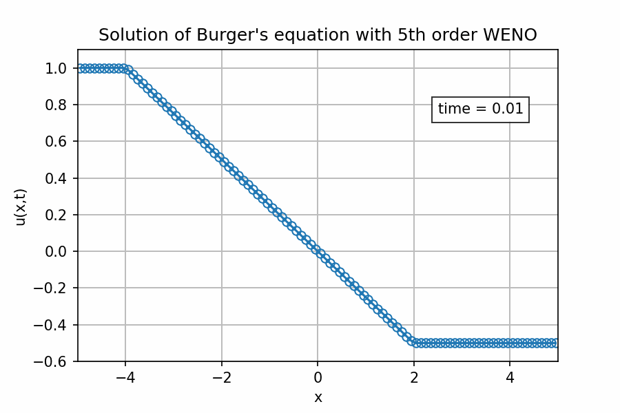
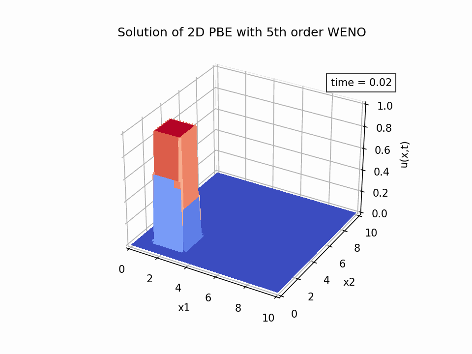

# HR-WENO (High-Resolution Weighted Essentially Non-Oscillatory)

[](https://github.com/HugoMVale/HR-WENO/actions)
[](https://codecov.io/gh/HugoMVale/HR-WENO)

<p align="center">
  
</p>

## Description

This package is a modern-Fortran implementation of selected high-resolution [weighted essentially non-oscillatory (WENO)](https://en.wikipedia.org/wiki/WENO_methods) schemes and [total variation diminishing (TVD)](https://en.wikipedia.org/wiki/Total_variation_diminishing) integration methods for solving [hyperbolic conservation equations](https://en.wikipedia.org/wiki/Hyperbolic_partial_differential_equation).

In particular, the package includes:
* WENO schemes up to 5th order;
* explicit Runge-Kutta TVD methods up to 3rd order;
* explicit 3rd order multi-step TVD method.  

All numerical methods are described in detail by [Shu (1997)](doc/Shu-WENO-notes.pdf).

## Documentation 

* This readme (start with that).
* [API Reference](https://hugomvale.github.io/HR-WENO/).

## Getting started

### Build

The easiest way to build/test the code and run the examples is by means of [`fpm`](https://fpm.fortran-lang.org/en/index.html). To run a given example, just do:

```
fpm run --example "example-filename"
```

and the numerical results will be stored in the [`output`](/output) subfolder. You can then use the provided Python script to read the data and plot the results.

### Usage

The ODE solvers (`rktvd` and `mstvd`) are called like most other solvers (e.g., LSODE): 

```fortran
use tvdode, only: rktvd
...
type(rktvd) :: ode
...
! Initialize solver object
ode = rktvd(rhs, neq=size(u), order=3)

! Integrate
time_start = 0._rk
time_end = 12._rk
dt = 1e-2_rk
time = time_start
num_time_points = 100
do i = 0, num_time_points
  time_out = time_end*i/num_time_points
  call ode%integrate(u, time, time_out, dt)
  call save_intermediate_results(u, time, ...)
end do
 ...
 ```
 
 The WENO reconstruction is even simpler to call:
 
 ```fortran
use hrweno, only: weno
...
type(weno) :: myweno
...
! Initialize weno object
myweno = weno(ncells=100, k=3, eps=1e-6_rk)
   
! Get reconstructed values at cell boundaries
call myweno%reconstruct(v, vl, vr)
...
```

## Examples

### Burgers' inviscid equation (1D)

This example ([`example1_burgers_1d_fv.f90`](/example/example1_burgers_1d_fv.f90)) illustrates the application of procedures `weno` and `rktvd` for solving [Burger's inviscid equation](https://en.wikipedia.org/wiki/Burgers%27_equation) using a finite volume (FV) formulation. The results are depicted in the figure at the top of the page and demonstrate the excellent resolution of the shock wave.

### Population balance equation (2D)
This example ([`example2_pbe_2d_fv.f90`](/example/example2_pbe_2d_fv.f90)) illustrates the application of procedures `weno` and `mstvd` for solving a [population balance equation](https://en.wikipedia.org/wiki/Population_balance_equation) with 2 internal coordinates using a finite volume (FV) formulation. The results are depicted in the figure below and demonstrate the excellent resolution of the pulse.

<p align="center">
  
</p>

