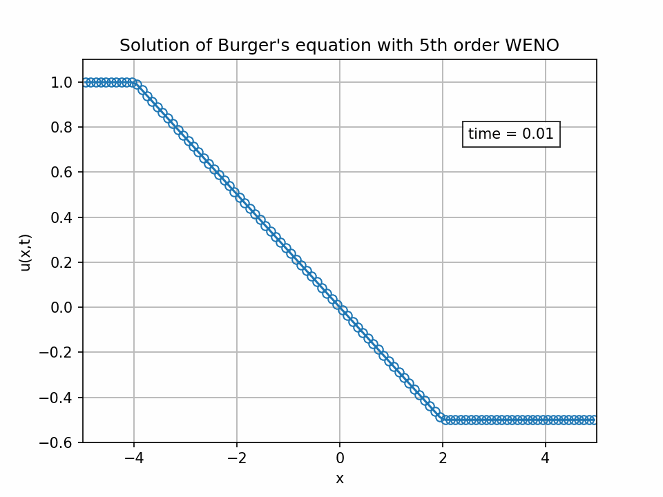

# HR-WENO

[](https://github.com/HugoMVale/HR-WENO/actions)

<p align="center">
  
</p>

## Description

This package is a modern-Fortran implementation of selected high-resolution [weighted essentially non-oscillatory (WENO)](https://en.wikipedia.org/wiki/WENO_methods) schemes and [total variation diminishing (TVD)](https://en.wikipedia.org/wiki/Total_variation_diminishing) integration methods for solving [hyperbolic conservation equations](https://en.wikipedia.org/wiki/Hyperbolic_partial_differential_equation).

In particular, the package includes WENO schemes up to 5th order, explicit Runge-Kutta TVD methods up to 3rd order, and an explicit 3rd order multi-step TVD method.  

All numerical methods are described in detail by [Shu (1997)](/Shu-WENO-notes.pdf).

## How to get started

The easiest way to build/test the code and run the examples is by means of [`fpm`](https://fpm.fortran-lang.org/en/index.html). To run the example, just do:
```
fpm run --example
```
and the numerical results will be stored in the [`output`](/output) subfolder. You can then use the provided Python script to read the data and plot the results.

## Example

### 1D-FV scalar problem: Burgers' equation

This example ([`example_fv_1d.f90`](/example/example_fv_1d.f90)) illustrates the application of procedures `wenok` and `rktvd` for solving [Burger's inviscid equation](https://en.wikipedia.org/wiki/Burgers%27_equation) using a finite volume (FV) formulation. The results are depicted in the figure at the top of the page and demonstrate the excellent resolution of the shock wave.
